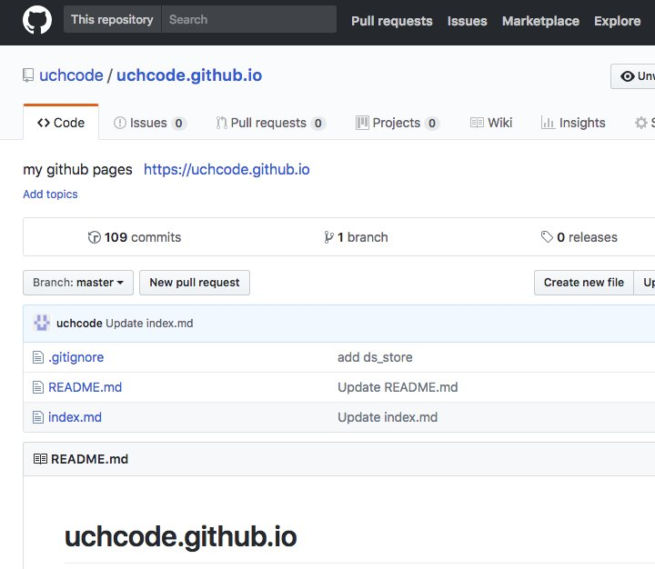
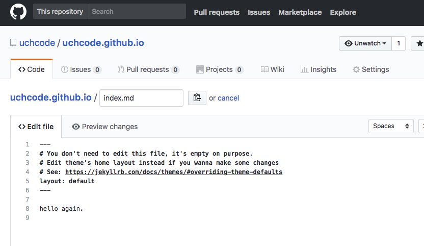
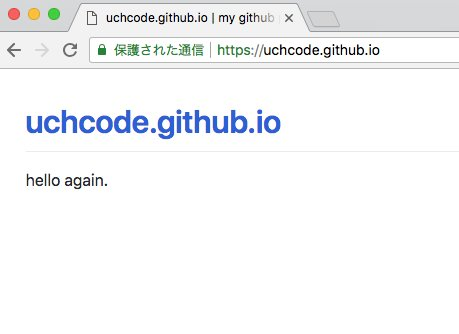
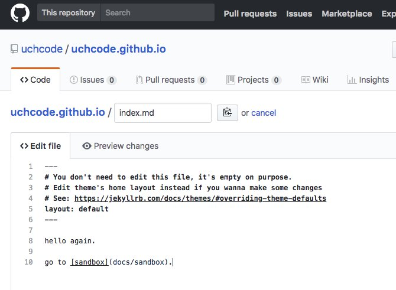
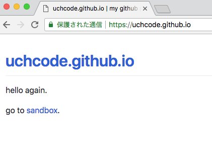
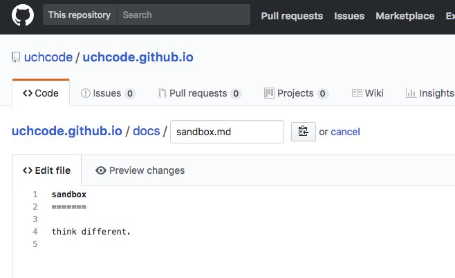
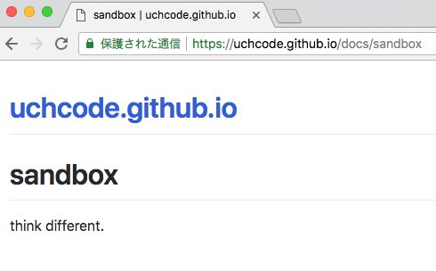

gh-pages settings
=================

まずトップページから。トップページのファイル名は```index.md```。



```index.md```の内容は以下の通り。



ポイントはレイアウトを```default```で指定するところ。本来なら```home```なのだけど、それはテーマファイルを用意した時に有効な指定。今はまだ用意していないので```defalut```とした。トップページ以外のレイアウト指定のデフォルトは```default```なので特に指定する必要はない。

内容を保存してしばらくするとhtmlファイルが自動生成されて[https://uchcode.github.io/](https://uchcode.github.io/)が見れるようになる。



次にリンク。```sandbox```ページを作成したものとしてリンクを書く。




```sandbox```ページの内容は以下の通り。




こんな感じで```gh-pages```をcmsとしてブラウザから利用できる。
